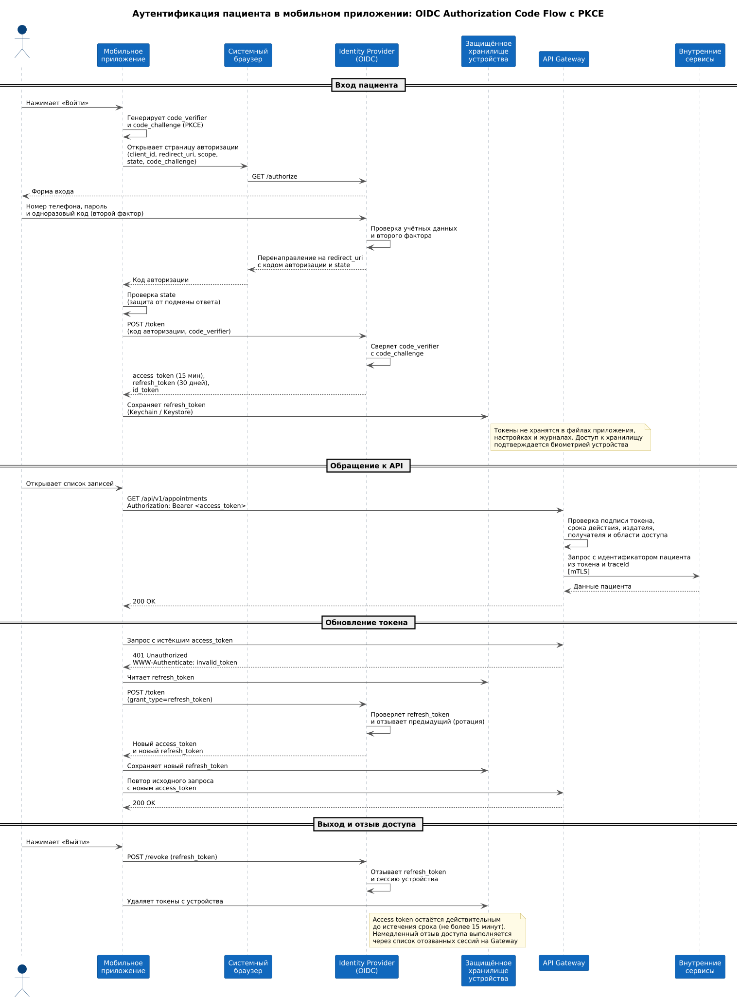

# Задание 4.3. Схема аутентификации пользователей мобильного приложения

## Выбранная схема

Аутентификация пациентов выполняется по протоколу **OpenID Connect (OIDC)**, поток **Authorization Code Flow с PKCE**. Токен доступа в формате **JWT** передаётся в заголовке `Authorization: Bearer <token>` при каждом обращении к API.

| Элемент | Решение |
|---|---|
| Протокол | OpenID Connect поверх OAuth 2.0 |
| Поток | Authorization Code Flow с PKCE (Proof Key for Code Exchange) |
| Где вводятся учётные данные | Системный браузер устройства, не форма внутри приложения |
| Второй фактор | Одноразовый код при входе на новом устройстве |
| Формат токена доступа | JWT, подписанный ключом Identity Provider |
| Способ передачи токена | Заголовок `Authorization: Bearer <token>` |
| Срок действия токена доступа | 15 минут |
| Срок действия токена обновления | 30 дней, с ротацией при каждом использовании |
| Хранение на устройстве | Keychain на iOS, Keystore на Android, доступ по биометрии |

## Схема

## Обоснование решений

### Почему OIDC, а не собственная аутентификация

OIDC отвечает на вопрос «кто этот пользователь», что и требуется для входа пациента. OAuth 2.0 без надстройки OIDC решает другую задачу — выдачу прав на доступ к ресурсам, и сам по себе личность пользователя не устанавливает. Собственная реализация входа означала бы самостоятельную разработку хранения паролей, восстановления доступа, блокировки при подборе и двухфакторной проверки, то есть повторение задач, решённых в готовом Identity Provider.

### Почему токен, а не серверная сессия

Токен самодостаточен: он содержит идентификатор пациента, срок действия и область доступа, подписан издателем и проверяется получателем локально по публичному ключу. Сервисы не хранят состояние между запросами, поэтому любой экземпляр обрабатывает любой запрос, что необходимо для горизонтального масштабирования под 50 тыс. пользователей.

Второй довод связан с уже выявленным дефектом: в текущем контуре зафиксирован случай, когда врач видел данные чужого пациента, и причиной предполагается подмена сессии. Идентификатор пациента внутри подписанного токена подменить нельзя без приватного ключа издателя, а проверка подписи выполняется на каждом запросе.

### Почему Authorization Code Flow с PKCE

Мобильное приложение — публичный клиент: его код распространяется через магазины приложений, и клиентский секрет в нём хранить нельзя, поскольку он извлекается из пакета приложения. PKCE решает эту задачу: приложение генерирует случайное значение `code_verifier`, отправляет на авторизацию его хеш `code_challenge`, а при обмене кода авторизации на токен предъявляет исходное значение. Перехваченный код авторизации бесполезен без `code_verifier`, который не покидает устройство.

Потоки, где приложение само собирает логин и пароль и отправляет их на сервер, не применяются: они требуют, чтобы пациент вводил пароль в интерфейс приложения, что усложняет обнаружение поддельных приложений и лишает возможности подключить внешние способы входа без изменения кода.

### Почему вход открывается в системном браузере

Форма входа внутри приложения не даёт пациенту проверить адрес страницы, на которой он вводит пароль. Системный браузер показывает адресную строку и сертификат сайта, а также не даёт коду приложения читать вводимые данные. Дополнительно это позволяет использовать сохранённые в браузере учётные данные и менеджер паролей устройства.

### Сроки действия токенов

Токен доступа проверяется локально, поэтому отозвать его мгновенно нельзя: пока срок не истёк, он остаётся действительным. Это компромисс между скоростью проверки и контролем отзыва. Срок в 15 минут ограничивает окно, в течение которого украденный токен пригоден к использованию.

Токен обновления живёт дольше, поэтому защищён иначе: он хранится в защищённом хранилище устройства и ротируется при каждом использовании. Если токен обновления был украден и использован злоумышленником, легитимное приложение при следующей попытке предъявит уже отозванное значение, Identity Provider обнаружит повторное использование и завершит все сессии пациента. Так кража токена обновления обнаруживается, а не остаётся незамеченной.

### Отзыв доступа

При выходе приложение отзывает токен обновления и удаляет токены с устройства. Для случаев, требующих немедленного прекращения доступа — потеря устройства, обращение пациента о взломе, обнаружение подозрительной активности — Identity Provider публикует список отозванных сессий, который API Gateway проверяет при валидации токена. Проверка выполняется по идентификатору сессии в токене и не требует обращения к Identity Provider на каждый запрос.

### Что передаётся в токене

| Поле | Назначение |
|---|---|
| `sub` | Идентификатор пациента. Именно он используется сервисами для выборки данных, а не параметр из запроса |
| `iss` | Издатель токена. Проверяется, чтобы не принять токен, выпущенный другим источником |
| `aud` | Получатель токена. Проверяется, чтобы токен, выданный для другого приложения, не подошёл к API пациентов |
| `exp` | Время истечения |
| `scope` | Область доступа: чтение записей, создание записи, чтение результатов анализов |
| `sid` | Идентификатор сессии. Используется при проверке списка отозванных сессий |

Медицинские данные, номера полисов, диагнозы и другие сведения в токен не помещаются: JWT не зашифрован, а лишь закодирован, и его содержимое читается любым, кто получил токен.

## Проверка токена на API Gateway

API Gateway выполняет проверку до маршрутизации запроса в сервисы:

1. Подпись токена проверяется публичным ключом Identity Provider, полученным по стандартному адресу набора ключей и кешируемым с периодическим обновлением.
2. Проверяются поля `exp`, `iss` и `aud`.
3. Проверяется наличие области доступа, требуемой для вызываемого метода.
4. Идентификатор сессии сверяется со списком отозванных.
5. Идентификатор пациента из токена передаётся в сервисы во внутреннем заголовке вместе с traceId.

Сервисы не принимают идентификатор пациента из параметров запроса или тела: единственный источник — значение, переданное шлюзом после проверки токена. Это исключает обращение к чужим данным подстановкой чужого идентификатора.

## Исходный код схемы (PlantUML)

